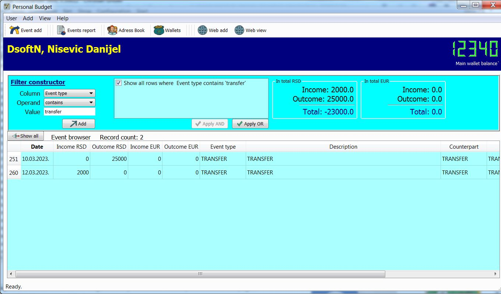
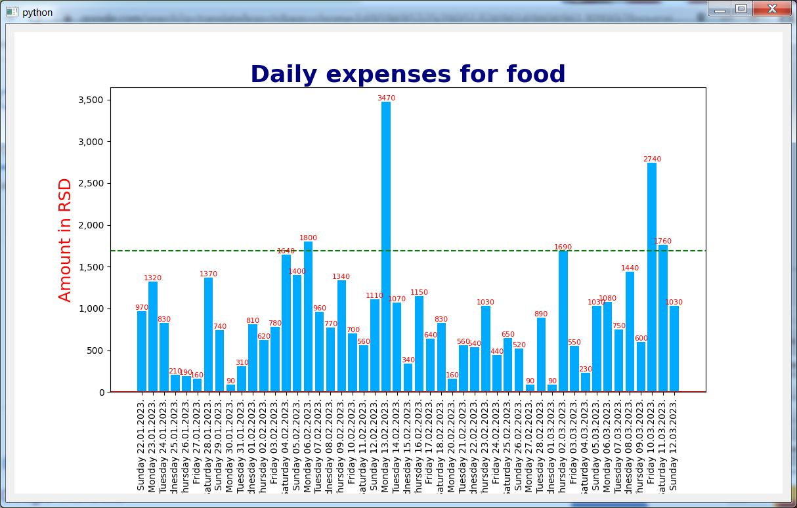

# Personal Budget

Personal budget is an application designed to manage personal expenses and income, as well as some important daily events.

The application is intended for personal use.

Based on the entered data, detailed reports on the inflow and outflow of money can be obtained.

Data is stored locally using SQLite database.

## User Interface

The user interface is made using the PyQt5 library.

The graphical user interface provides an easy and intuitive way to use the application.

## Languages

The currently supported languages ​​are English and Serbian, with the possibility of other languages ​​being easily implemented in the application.
